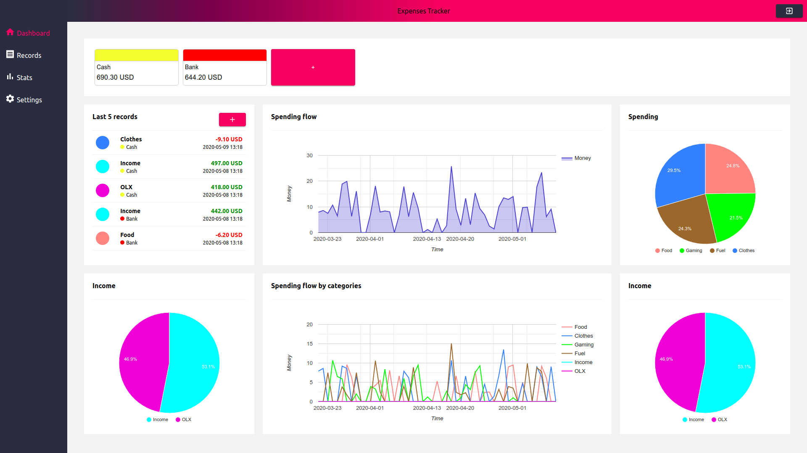
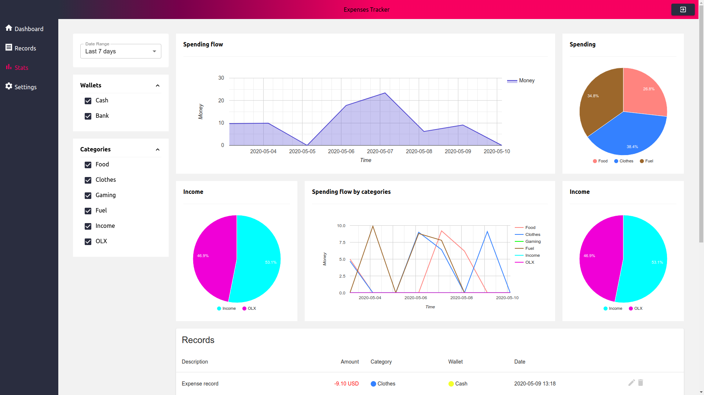

# Expenses Tracker
> Manage your finances and stop wondering where you spent your money.

#### Homepage

#### Dashboard

#### Stats


## Prerequisites
- [Docker](https://docs.docker.com/get-docker/)
- [Docker Compose](https://docs.docker.com/compose/install/)
- [Yarn](https://classic.yarnpkg.com/en/docs/install/#debian-stable)

## Run 
- Clone the project
    ```
    git clone git@github.com:snaksa/expense-tracker-frontend.git
    cd expense-tracker-frontend
    ```

- Install dependencies
    ```
    yarn install
    ```

- Build the containers
    ```
    docker-compose build
    docker-compose up -d
    ```

- Run backend migrations and fixtures
    ```
    docker exec -it expense-tracker-backend bin/console doctrine:migrations:migrate --quiet
    docker exec -it expense-tracker-backend bin/console doctrine:fixtures:load --quiet --env=fixtures
    ```

- Go to [http://localhost:3000](http://localhost:3000)
- Login with the following credentials
    ```
    email: demo@gmail.com
    password: 123456
    ```
